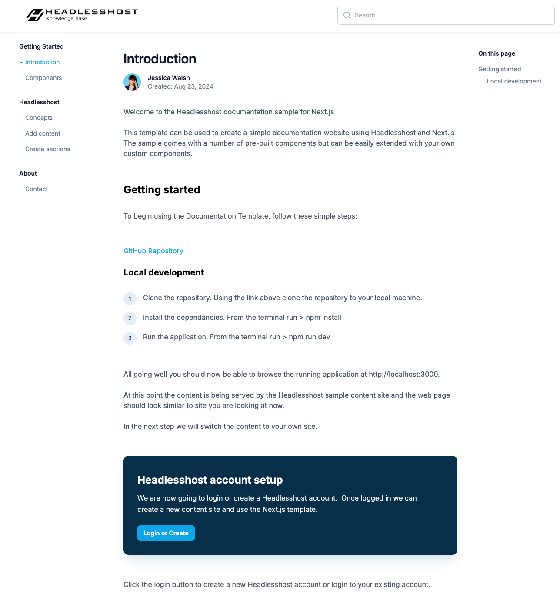

## Headlesshost Knowledgebase - Documentation Template

This template can be used to create a simple documentation website using Headlesshost and Next.js The sample comes with a number of pre-built components but can be easily extended with your own custom designs.

This is a [Next.js](https://nextjs.org/) project bootstrapped with [`create-next-app`](https://github.com/vercel/next.js/tree/canary/packages/create-next-app).

## Deploy on Vercel

The best way to deploy this Next.js app is to use the [Vercel Platform](https://vercel.com/new?utm_medium=default-template&filter=next.js&utm_source=create-next-app&utm_campaign=create-next-app-readme) from the creators of Next.js.

Vercel provides pre-production features that couple perfectly with Headlesshost staging sites. These features enable users to preview content changes in real time and collaborate with the Vercel inline commenting tools.

Click on the button below to fully automate your deployment.

[](https://vercel.com/new/clone?repository-url=https%3A%2F%2Fgithub.com%2FHeadlesshost%2Freact.nextjs.knowledgebase&project-name=knowledgebase&repository-name=knowledgebase&redirect-url=https%3A%2F%2Freact-nextjs-knowledgebase.vercel.app%2Fknowledgebase%2Fdp_vercel&demo-title=Headlesshost%20Knowledgebase&demo-description=A%20Next.js%20knowledgebase%20backed%20by%20Headlesshost&demo-url=https%3A%2F%2Freact-nextjs-knowledgebase.vercel.app&demo-image=https%3A%2F%2Fgithub.com%2FHeadlesshost%2Freact.nextjs.knowledgebase%2Fraw%2Fmaster%2Fpublic%2Fhome.png)

## Live Demo

Open <a href="https://react-nextjs-knowledgebase.vercel.app/knowledgebase/gs_intro" target="_blank">https://react-nextjs-knowledgebase.vercel.app</a> for a live demo.

<a href="https://react-nextjs-knowledgebase.vercel.app/knowledgebase/guide" target="_blank">Click here</a> for a list of current components.

For a guide on how to implement your own components <a href="https://react-nextjs-knowledgebase.vercel.app/knowledgebase/hh_sections" target="_blank">click here</a>

For a guide on how to connect your own content <a href="https://react-nextjs-knowledgebase.vercel.app/knowledgebase/hh_content" target="_blank">click here </a>

<a href="https://react-nextjs-knowledgebase.vercel.app/knowledgebase/gs_intro" target="_blank">

</a>
<br/>

## Deploy Locally

Alternatively you can deploy locally.

First, install packages and then run the development server:

```bash
# Clone this repo to your local machine

npm install

npm run dev

```

Open [http://localhost:3000](http://localhost:3000) with your browser to see the result.
